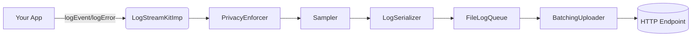

# LogStreamKit

Composable, privacy-first, real-time logging SDK for iOS. Log events, errors, and breadcrumbs with sampling, local queueing, and batched uploads.

<p align="left">
  <a href="https://swift.org/"></a>
  <a href="#installation"></a>
  <a href="#installation"></a>
  
  <a href="LICENSE"></a>
</p>

---

- Zero-dependency Swift Package with clear separation of concerns: interfaces, implementation, and test mocks
- Privacy guardrails (PII scrubbing) and adjustable sampling to control signal vs noise
- Durable local queue backed by disk and batched network uploads with retry scheduling
- Clean protocol surface for easy mocking and testability

## Contents
- [Why LogStreamKit](#why-logstreamkit)
- [Architecture](#architecture)
- [Installation](#installation)
- [Quick start](#quick-start)
- [API](#api)
- [Examples](#examples)
- [Testing with mocks](#testing-with-mocks)
- [Privacy and security](#privacy-and-security)
- [Performance](#performance)
- [Roadmap](#roadmap)
- [License](#license)

## Why LogStreamKit
Modern apps need structured telemetry that’s privacy-aware and resilient. LogStreamKit gives you:
- Composability: swap sampler, privacy policy, queue, serializer, uploader
- Operational control: per-event sampling, batching thresholds, and flush hooks
- Reliability: disk-backed queue and connectivity-aware uploader
- Testability: protocol-first design plus a ready-made `LogStreamKitMock`

## Architecture
LogStreamKit follows a pipeline model. The public API is minimal; the implementation composes focused services.



Key components (implementation):
- PrivacyEnforcer: allows/denies logging, scrubs PII (e.g., hashes emails)
- Sampler: per-event sampling with a default fallback
- LogSerializer: JSON encoder with ISO-8601 dates and typed payloads
- FileLogQueue: FIFO queue backed by Caches directory
- BatchingUploader: POSTs JSON batches with size/time thresholds and retries

Interfaces live in `Sources/LogStreamKit/interfaces/src` and are shipped as the `LogStreamKit` product. Concrete implementations are under `implementation/src` as the `LogStreamKitImp` product. Mocks are under `mocks/src` as `LogStreamKitMock`.

## Installation

### Swift Package Manager
- Xcode: File → Add Packages… → enter repo URL `https://github.com/harryngict/LogStreamKit`
- Or in `Package.swift`:

```swift
.dependencies: [
  .package(url: "https://github.com/harryngict/LogStreamKit", from: "0.1.0")
],
.targets: [
  .target(name: "YourApp", dependencies: [
    .product(name: "LogStreamKit", package: "LogStreamKit"),
    .product(name: "LogStreamKitImp", package: "LogStreamKit"),
  ])
]
```

Then import the modules you use:

```swift
import LogStreamKit       // protocol surface
import LogStreamKitImp    // concrete implementations
```

### CocoaPods
Add to your `Podfile` (iOS 15+):

```ruby
platform :ios, '15.0'
use_frameworks!

target 'YourApp' do
  pod 'LogStreamKit'
  pod 'LogStreamKitImp'  # runtime implementation
end

target 'YourAppTests' do
  inherit! :search_paths
  pod 'LogStreamKitMock' # for unit tests
end
```

## Quick start
Create a logger with sensible defaults and start sending events.

```swift
import LogStreamKit
import LogStreamKitImp

let privacy = PrivacyEnforcerImp(allowLogging: true, scrubEmail: true)
let sampler = SamplerImp(samplingRates: [
  "error": 1.0,
  "debug": 0.2,
  "default": 0.1,
])
let serializer = LogSerializerImp()
let queue = try FileLogQueue(directoryName: "logqueue")
let endpoint = URL(string: "https://example.com/ingest/logs")!
let uploader = BatchingUploader(queue: queue, serializer: serializer, endpoint: endpoint)

let logger = LogStreamKitImp(
  privacy: privacy,
  sampler: sampler,
  serializer: serializer,
  queue: queue,
  uploader: uploader,
  endpoint: endpoint,
  sessionId: "session-123"
)

logger.logEvent("video_play", params: ["video_id": "abc123", "duration_ms": 1200], level: .info)
logger.logError(NSError(domain: "demo", code: 999), metadata: ["context": "player"])

// e.g., when app goes background or on a screen pop
logger.flush { ok in
  print("flushed: \(ok)")
}
```

A runnable demo lives in `Example/Sources/LogStreamKitDemo` and wires everything similarly.

## API
Public surface (`LogStreamKit` protocol):

```swift
public protocol LogStreamKit: AnyObject {
  func logEvent(_ name: String, params: [String: Any]?, level: LogLevel)
  func logError(_ error: Error, metadata: [String: Any]?)
  func flush(completion: @escaping (Bool) -> Void)
}

public enum LogLevel: String { case debug, info, warn, error, fatal }
```

Implementation highlights:
- Events and errors are normalized into `LogEntry` with device, session, level, and parameters.
- Params are optionally scrubbed, then encoded to JSON and persisted to the disk queue.
- The uploader batches files (count and byte-size limits) and POSTs a JSON array.

## Examples
Targeted sampling and PII scrubbing:

```swift
let sampler = SamplerImp(samplingRates: [
  "search": 0.05,   // keep 5% of high-volume searches
  "error": 1.0,     // keep all errors
  "default": 0.1
])

let privacy = PrivacyEnforcerImp(allowLogging: true, scrubEmail: true)
logger.logEvent("search", params: ["query": "funny dogs", "user_email": "test@example.com"], level: .debug)
// user_email will be hashed before leaving the device
```

Tuning batching and connectivity behavior:

```swift
let uploader = BatchingUploader(
  queue: queue,
  serializer: serializer,
  endpoint: endpoint,
  backgroundSessionIdentifier: nil,
  batchSize: 100,
  maxBatchBytes: 256 * 1024,
  minInterval: 5.0
)
```

## Testing with mocks
Use `LogStreamKitMock` to verify calls and inject behavior without hitting disk/network:

```swift
import XCTest
import LogStreamKit
import LogStreamKitMock

final class LoggerTests: XCTestCase {
  func testCalls() {
    let mock = LogStreamKitMock()
    var flushed = false

    mock.logEventHandler = { name, params, level in
      XCTAssertEqual(name, "signup")
      XCTAssertEqual(level, .info)
    }
    mock.flushHandler = { done in
      flushed = true; done(true)
    }

    mock.logEvent("signup", params: ["method": "apple"], level: .info)
    mock.flush { _ in }

    XCTAssertEqual(mock.logEventCallCount, 1)
    XCTAssertTrue(flushed)
  }
}
```

## Privacy and security
- Email scrubbing: when enabled, any string containing "@" in params is hashed client-side.
- Central kill switch: `allowLogging` disables all outbound logging instantly.
- You own the endpoint: logs are POSTed to your HTTPS endpoint as JSON arrays.

Note: Review your params for PII/SPI and extend `PrivacyEnforcer` to meet your policy.

## Performance
- Disk-backed queue in Caches directory; operations are serialized on internal queues.
- Batching by count and bytes reduces chattiness and saves radio time.
- Sampling provides backpressure for high-volume events.

## Roadmap
- Retry metadata (attempt counters) and exponential backoff
- Background transfer integration and reachability gating
- Metrics and breadcrumb first-class types
- Disk usage quotas and rotation policies
- OSLog/Unified Logging bridge

## License
MIT. See `LICENSE`.
